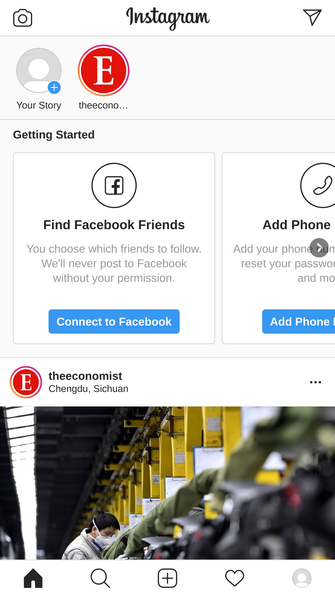

<!-- README.md is generated from README.Rmd. Please edit that file -->

```{r, include = FALSE}
knitr::opts_chunk$set(
  collapse = TRUE,
  comment = "#>"
)
```

# Post R plot to Instagram on RStudio (or on whatever editor)

## Install chromote

* chromote: <https://github.com/rstudio/chromote>

```{r install-chromote, eval=FALSE}
devtools::install_github("rstudio/chromote")
```

### (Linux only?) Set `CHROMOTE_CHROME`

I use Manjaro Linux, so I needed to set this by myself.

```{r set-envvar}
# TODO: remove this after https://github.com/rstudio/chromote/pull/27 gets merged
Sys.setenv(CHROMOTE_CHROME="/usr/bin/chromium")
```

### Confirm chromote works

```{r confirm}
library(chromote)

b <- ChromoteSession$new()
b$Browser$getVersion()
```

## Get device profiles

The profiles of mobile devices are available on `front_end/emulated_devices/module.json` of [`ChromeDevTools/devtools-frontend` repository](https://github.com/ChromeDevTools/devtools-frontend).

c.f. <https://github.com/mafredri/cdp/issues/93#issuecomment-486683596>

```{r download-json, eval=!file.exists("data/module.json")}
dir.create("data", showWarnings = FALSE)
download.file(
  "https://raw.githubusercontent.com/ChromeDevTools/devtools-frontend/master/front_end/emulated_devices/module.json",
  destfile = "data/module.json"
)
```

```{r process-json}
library(purrr)

j <- jsonlite::read_json("data/module.json")

idx <- map_chr(j$extensions, "type") == "emulated-device"
j <- map(j$extensions, "device")[idx]
names(j) <- map_chr(j, "title")
```

## Set up emulation

```{r emulation}
device <- j$`Nexus 5X`
orientation <- "vertical" # can choose vertical or horizontal

b$Emulation$setUserAgentOverride(userAgent = device$`user-agent`)
b$Emulation$setDeviceMetricsOverride(
  deviceScaleFactor = device$screen$`device-pixel-ratio`,
  width = device$screen[[orientation]]$width,
  height = device$screen[[orientation]]$height,
  mobile = TRUE
)
```

## Login

```{r save-cookie, eval=FALSE}
b$Page$navigate("https://www.instagram.com/accounts/login/")

b$view()
# (Manually log in)

cookies <- b$Network$getCookies()
saveRDS(cookies, "data/cookies.rds")
```

```{r login, out.width='300px'}
cookies <- readRDS("data/cookies.rds")
b$Network$setCookies(cookies = cookies$cookies)

p <- b$Page$navigate("https://www.instagram.com/", wait_ = FALSE)$
  then(function(value) {
    b$Page$loadEventFired(wait_ = FALSE)
  })

b$wait_for(p)

b$screenshot(filename = "screenshot.png")

```


## Post a plot

(This chunk is not executed because I don't want to post the same plot thousands of times...)

```{r plot, eval=FALSE}
library(ggplot2)

p <- ggplot(mtcars, aes(factor(cyl), mpg)) +
  geom_violin(aes(fill = factor(cyl)))
tmp <- tempfile(fileext = ".jpg")
ggsave(p, filename = tmp)

# content is a Quad object:
# "An array of quad vertices, x immediately followed by y for each point, points clock-wise."
calc_center_of_content <- function(content) {
  list(
    x = (content[[1]] + content[[3]]) / 2,
    y = (content[[2]] + content[[8]]) / 2
  )
}

# insert file
# need to click + button to pretend as a human
root <- b$DOM$getDocument()$root$nodeId
divs <- b$DOM$querySelectorAll(root, "nav div")
is_plus <- map_lgl(divs$nodeIds, ~ "new-post-button" %in% b$DOM$getAttributes(.)$attributes)
plus_button <- b$DOM$getBoxModel(divs$nodeIds[[which(is_plus)]])
ctr <- calc_center_of_content(plus_button$model$content)
b$Input$synthesizeTapGesture(x = ctr$x, y = ctr$y)

Sys.sleep(1)

root <- b$DOM$getDocument()$root$nodeId
file_inputs <- b$DOM$querySelectorAll(root, "form input")
length(file_inputs$nodeIds)
b$DOM$setFileInputFiles(
  list(tmp),
  file_inputs$nodeIds[[length(file_inputs$nodeIds)]]
)

Sys.sleep(1)

# tap "Next"
root <- b$DOM$getDocument()$root$nodeId
buttons <- b$DOM$querySelectorAll(root, "button")
is_next <- map_lgl(buttons$nodeIds, ~ stringr::str_detect(b$DOM$getOuterHTML(.), "Next"))
button <- b$DOM$getBoxModel(buttons$nodeIds[[which(is_next)]])
ctr <- calc_center_of_content(button$model$content)
b$Input$synthesizeTapGesture(x = ctr$x, y = ctr$y)

Sys.sleep(1)

# Add text
root <- b$DOM$getDocument()$root$nodeId
textareas <- b$DOM$querySelectorAll(root, "textarea")
is_caption <- map_lgl(textareas$nodeIds, ~ "Write a caption…" %in% b$DOM$getAttributes(.)$attributes)
caption <- b$DOM$getBoxModel(textareas$nodeIds[[which(is_caption)]])
# move focus to text area
ctr <- calc_center_of_content(caption$model$content)
b$Input$synthesizeTapGesture(x = ctr$x, y = ctr$y)
# insert text
b$Input$insertText("This post is posted from RStudio")

Sys.sleep(1)

# tap "Share"
root <- b$DOM$getDocument()$root$nodeId
buttons <- b$DOM$querySelectorAll(root, "button")
is_share <- map_lgl(buttons$nodeIds, ~ stringr::str_detect(b$DOM$getOuterHTML(.), "Share"))
button <- b$DOM$getBoxModel(buttons$nodeIds[[which(is_share)]])
ctr <- calc_center_of_content(button$model$content)
b$Input$synthesizeTapGesture(x = ctr$x, y = ctr$y)
```

## End

```{r close}
b$close()
```
