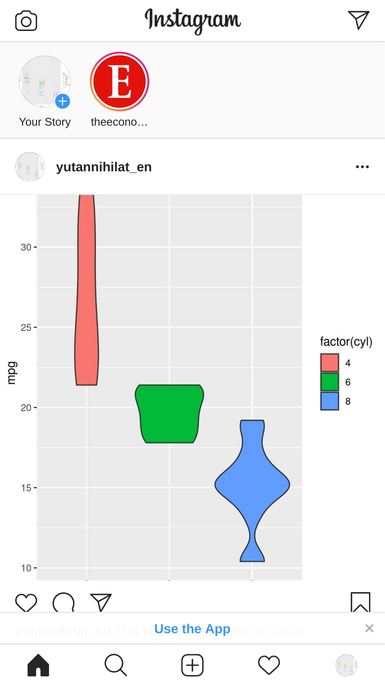

<!-- README.md is generated from README.Rmd. Please edit that file -->

# Post R plot to Instagram on RStudio (or on whatever editor)

## Install chromote

  - chromote: <https://github.com/rstudio/chromote>

<!-- end list -->

``` r
devtools::install_github("rstudio/chromote")
```

### (Linux only?) Set `CHROMOTE_CHROME`

I use Manjaro Linux, so I needed to set this by myself.

``` r
Sys.setenv(CHROMOTE_CHROME="/usr/bin/chromium")
```

### Confirm chromote works

``` r
library(chromote)

b <- ChromoteSession$new()
b$Browser$getVersion()
#> $protocolVersion
#> [1] "1.3"
#> 
#> $product
#> [1] "HeadlessChrome/80.0.3987.87"
#> 
#> $revision
#> [1] "@449cb163497b70dbf98d389f54e38e85d4c59b43"
#> 
#> $userAgent
#> [1] "Mozilla/5.0 (X11; Linux x86_64) AppleWebKit/537.36 (KHTML, like Gecko) HeadlessChrome/80.0.3987.87 Safari/537.36"
#> 
#> $jsVersion
#> [1] "8.0.426.16"
```

## Get device profiles

The profiles of mobile devices are available on
`front_end/emulated_devices/module.json` of
[`ChromeDevTools/devtools-frontend`
repository](https://github.com/ChromeDevTools/devtools-frontend).

c.f. <https://github.com/mafredri/cdp/issues/93#issuecomment-486683596>

``` r
dir.create("data", showWarnings = FALSE)
download.file(
  "https://raw.githubusercontent.com/ChromeDevTools/devtools-frontend/master/front_end/emulated_devices/module.json",
  destfile = "data/module.json"
)
```

``` r
library(purrr)

j <- jsonlite::read_json("data/module.json")

idx <- map_chr(j$extensions, "type") == "emulated-device"
j <- map(j$extensions, "device")[idx]
names(j) <- map_chr(j, "title")
```

## Set up emulation

``` r
device <- j$`iPhone 6/7/8 Plus`
orientation <- "vertical" # can choose vertical or horizontal

b$Emulation$setUserAgentOverride(userAgent = device$`user-agent`)
#> named list()
b$Emulation$setDeviceMetricsOverride(
  deviceScaleFactor = device$screen$`device-pixel-ratio`,
  width = device$screen[[orientation]]$width,
  height = device$screen[[orientation]]$height,
  mobile = TRUE
)
#> named list()
```

## Login

``` r
b$Page$navigate("https://www.instagram.com/accounts/login/")

b$view()
# (Manually log in)

cookies <- b$Network$getCookies()
saveRDS(cookies, "data/cookies.rds")
```

``` r
cookies <- readRDS("data/cookies.rds")
b$Network$setCookies(cookies = cookies$cookies)
#> named list()
b$Page$navigate("https://www.instagram.com/accounts/login/")
#> $frameId
#> [1] "7FE8413EE0B65E30C24F19CD1CEB209E"
#> 
#> $loaderId
#> [1] "BECEA54D479C5AC962BFC73CC0554139"
b$Page$loadEventFired()
#> $timestamp
#> [1] 13173.72

b$screenshot(filename = "screenshot.png")
#> [1] "screenshot.png"
```



## Post a plot

``` r
library(ggplot2)
p <- ggplot(mpg, aes(cyl, hwy)) +
  geom_jitter(aes(colour = class))
tmp <- tempfile(fileext = ".jpg")
ggsave(p, filename = tmp)

# insert file
root <- b$DOM$getDocument()$root$nodeId
file_inputs <- b$DOM$querySelectorAll(root, "form input")
b$DOM$setFileInputFiles(list(tmp), file_inputs$nodeIds[[length(file_inputs$nodeIds)]])

# tap "Next"
root <- b$DOM$getDocument()$root$nodeId
buttons <- b$DOM$querySelectorAll(root, "button")
is_next <- map_lgl(buttons$nodeIds, ~ stringr::str_detect(b$DOM$getOuterHTML(.), "Next"))
button <- b$DOM$getBoxModel(buttons$nodeIds[[which(is_next)]])
b$Input$synthesizeTapGesture(x = button$model$content[[5]], y = button$model$content[[6]], duration = 1)

# Add text
root <- b$DOM$getDocument()$root$nodeId
textareas <- b$DOM$querySelectorAll(root, "textarea")
is_caption <- map_lgl(textareas$nodeIds, ~ "Write a caption…" %in% b$DOM$getAttributes(.)$attributes)
caption <- b$DOM$getBoxModel(textareas$nodeIds[[which(is_caption)]])
# move focus to text area
b$Input$synthesizeTapGesture(x = caption$model$content[[5]], y = caption$model$content[[6]], duration = 1)
# insert text
b$Input$insertText("This post is posted from RStudio")

# tap "Share"
root <- b$DOM$getDocument()$root$nodeId
buttons <- b$DOM$querySelectorAll(root, "button")
is_share <- map_lgl(buttons$nodeIds, ~ stringr::str_detect(b$DOM$getOuterHTML(.), "Share"))
button <- b$DOM$getBoxModel(buttons$nodeIds[[which(is_share)]])
b$Input$synthesizeTapGesture(x = button$model$content[[5]], y = button$model$content[[6]], duration = 1)
```

## End

``` r
b$close()
#> [1] TRUE
```
